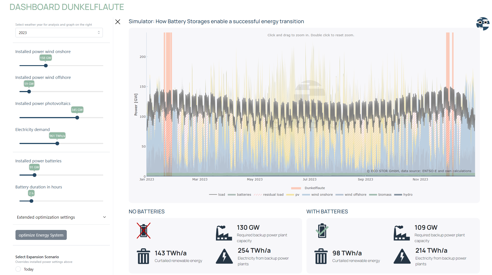

# dunkelflaute
Optimization model behind https://dashboards.eco-stor.de/dunkelflaute  

This repository contains the model to recreate the optimizations of the online tool published by [ECO STOR GmbH](https://eco-stor.de)

## How to use
The underlying optimization model can be found in model.py.  

You can use main.py to set up a simulation using your own data and assumptions, evaluate the results and create a result figure (similar to the one on our dashboard).

You will need to install `pandas`, `plotly` and `pypsa`

## Input data
We use publicly available data from [ENTSO-E Transparency Platform](https://transparency.entsoe.eu/) in our dashboard. The data is not provided in this repository but can be easily downloaded.

## Authors
&copy; ECO STOR GmbH  
Please direct questions to Amadeus Teuffel (at@eco-stor.de)
